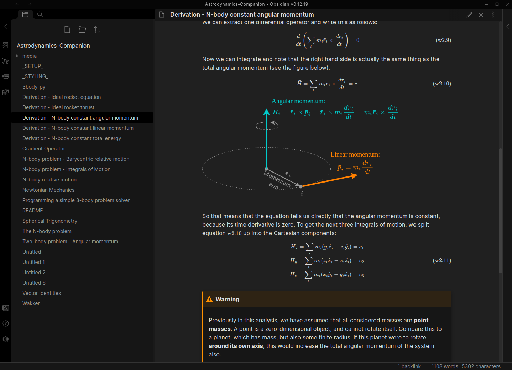
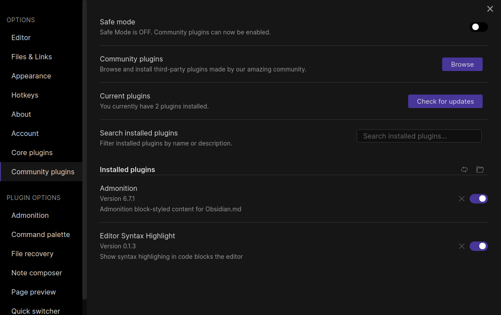

<!---Note: Although this is a markdown file, this specific README.md file is written for the GitHub markdown interpreter, not the Obsidian Md interpreter. As a result, this page may not be displayed correctly in Obsidian Md. Don't worry, this is fine, as this page is not part of the companion.    ---> 

# AE4874-Companion
An Obsidian Md vault containing a study companion / summary for the AE4874 Astrodynamics course.

The contents of this repo are an [Obsidian Md](https://obsidian.md/) vault, which is a collection of interconnected markdown (.md) files. This creates a network of readable information that acts much like a local Wiki, or a web-book. In the terminology of Obsidian Md, such a collection of markdown files is called a **vault**.
___
## Progress


___
## Quick start guide
1. **Install Obsidian Md** from the [download webpage](https://obsidian.md/download). It is available for Linux, Windows, and MacOS. This quick start guide will assume you are using Linux. 
   I recommend installing either the .deb or .tar.gz, but there are flatpak and Snap store versions available too. There is currently no way to install using `apt`.
2. **Download this repository**. You can download it as a .zip file with the button above, or clone from the command line interface using
```md
git clone https://github.com/Hans-Bananendans/Astrodynamics-Companion.git
```
or
```md
gh repo clone Hans-Bananendans/Astrodynamics-Companion
```
(this command requires the [GitHub CLI](https://cli.github.com/) to be installed)

3. Open Obsidian Md, open a vault and select the option *Open folder as vault*. Select the folder in which you cloned this repository as the vault location. If successful, you will see a list of the files in this repository appear in a column on the left-hand side.


4. (OPTIONAL) In Obsidian Md, go to **Options** -> **Community plugins** and turn Safe mode OFF. Obsidian Md can be expanded using an increasingly large pool of community-made plugins. These plugins cannot be validated by the Obsidian Md developers, and so they disable the use of these plugins by default. Don't worry, this repository only uses two plugins, both of which are open-source and safe for use.
5. (OPTIONAL) Install the [Admonition](https://github.com/valentine195/obsidian-admonition) plugin. Click **Options** -> **Community plugins** -> **Browse community plugins** and search for "Admonition". After it has installed the plugin, enable it by ticking the box.
    **This plugin is optional, but highly recommended, as this companion uses the Admonition boxes a lot to add emphasis and hide large mathematical derivations.**
6. (OPTIONAL) Also install the [Editor Syntax Highlight](https://github.com/deathau/cm-editor-syntax-highlight-obsidian) plugin. This will make it easier to read the code snippets contained in the companion.
If you went through the optional steps, the Community Plugin tab in the Option panel should look like this:

And that's it, you should now be good to go
___

## Dark mode
This companion is set up in such a way that **it does not matter whether you use light or dark mode**. All the figures use colours and shades that have enough contrast to see on light or dark backgrounds. My preference is to use dark mode, as it is easier on the eyes at night, but feel free to take your pick.


___
## Using this companion
\< add description \>


___
## Contribution
If you are a fellow student and would like to contribute to this guide, feel free to contact me!

___
## Dependencies
This Obsidian vault uses the following community plugins:
 - [Admonition](https://github.com/valentine195/obsidian-admonition)
 - [Editor Syntax Highlight](https://github.com/deathau/cm-editor-syntax-highlight-obsidian)