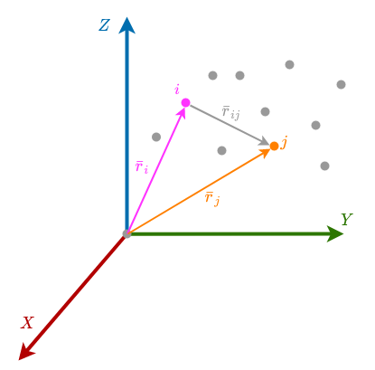

# The N-body problem
<!-- This covers sections 2.1-2.2, 2.6-2.7 from [Wakker] -->

___
## Introduction
In the [[Newtonian Mechanics#Newton's law of gravity|section on Newtonian Gravitation]], we discussed how one can use Newton's law of gravity to find the gravity force between two masses at a certain distance from another:

$$\bar{F} = -G\dfrac{m_1 m_2}{r^3}\bar{r} \tag{w1.12}$$

In this section we will see what happens if we have a cloud of $N$ point masses, and we attempt to use this this law to describe the internal dynamics. In principle, it should just be a matter of applying this law for every permutation of two bodies in the system, summing them all up, and if we do our book-keeping well, we should arrive at the right answer.

Well yes. But as soon as you then let the bodies move a bit under the force they experience, the situation has changed. The masses now are at different positions from one another, and we would have to redo the calculation. Is it possible to describe the system in the future, when an arbitrary amount of time has gone by? Turns out that in general: no, this is not possible. But there are some exceptions:
 - Any 2-body system can be described with a [closed-form](https://en.wikipedia.org/wiki/Closed-form_expression) expression. This is true generally.
 - For most 3-body systems, it is not possible to write down an explicit, closed-form expression, but there are many [special cases](https://en.wikipedia.org/wiki/Three-body_problem#Special-case_solutions) in which it is possible.
 - In general, it is **not possible** to describe an N-body system with a closed-form expression. 

So in general, one has to resort to calculating a frozen snapshot of the N-body system, calculating all the distances and masses, applying equation $\text{w1.12}$ for all permutations of all sets of two bodies, which gives you the force acting on each mass. Then one can calculate the acceleration of each mass by applying [[Newtonian Mechanics#Newton's second law|Newton's second law]], and let the system go do it's thing for a small amount of time. After this small amount of time, one re-evaluates the system and begins all over again.

This, by the way, is what orbit propagators essentially do all day, although there are lots of clever tricks and techniques one can apply. In addition, reality is much more complex than a simple Newtonian system with point masses can describe, and so you frequently need additional models to describe things like non-homogeneous mass distributions in the body, atmospheric effects, relativistic effects, etc. Even if ignoring all that, the bottom line is that as far as we know, the general N-body problem is [[Newtonian Mechanics#Chaotic motion|chaotic]] in nature, and we have no closed-form way to describe its long-term behaviour. [[The N-body problem#Index|^]]

___
## Setting up the N-body problem
<!-- [Wakker] chapter 2 introduction -->
To give us somewhere to start from mathematically, let's consider the cloud of $n$ point masses in the following diagram:


In this diagram, we have an inertial reference frame XYZ, relative to which each point's position can be described with a vector $\bar{r}$. We now consider a body $i$ and a body $j$; two arbitrary bodies in this cloud of point masses. As before, we can describe the position of such a point with a vector from the origin to the point: here we have $\bar{r}_i$ and $\bar{r}_j$. The relative distance between them we will describe with a vector $\bar{r}_{ij}$, which is the vector pointing **from** $i$ **to** $j$.

```ad-warning
title: Assumption: All masses are point masses
color: 200,80,225
```

With this in mind, we consider point $i$ and start to apply [[Newtonian Mechanics#Newton's second law|Newton's second law]]:
$$m_i \bar{a}_i = \bar{F}$$

When we consider only look at the effect of the depicted orange particle $j$ on $i$, we get:
$$m_i \dfrac{d^2 \bar{r}_i}{dt^2} =  \bar{F}_{ij} = G \dfrac{m_i m_j}{r^3_{ij}} \bar{r}_{ij}$$

Instead, now we want to consider the effect of all other particles on $i$. To do this, we turn $j$ into an **iterator**, and we use it to refer to "_any particle other than $i$_". Instead of the above, we get:
$$m_i \dfrac{d^2 \bar{r}_i}{dt^2} = \sum_{j \neq i} G \dfrac{m_i m_j}{r^3_{ij}} \bar{r}_{ij} \tag{w2.3}$$

Note that under the summation, we write $j \neq i$ because the force on $i$ because of its own gravity ($j = i$) is zero anyway.

So if we consider the points to be 3D space, each vector $\bar{r}$ is of length $3$. So this is three second-order differential equations packed in one expression, and that is just to describe the particle $i$. Therefore for a system of $n$ bodies, we have to solve $3n$ second-order differential equations! 

```ad-tip
title: Tip: Programming N-body solvers
icon: lightbulb

Rather than solving these differential equations this by hand, you will of course want to write some software that will do it for you. It is fairly straightforward to do so with many different programming languages. 

I personally recommend that for your own understanding of the material, you take aside a few hours and try to do this for yourself. You will come out of it with a much better understanding of the theory, and if you're going to do anything semi-serious work related to Astrodynamics, you need to know that anyway. If you get stuck, you can refer to my [[Programming a simple 3-body problem solver|tutorial on this topic]].

```

___
